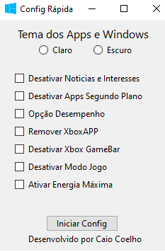

# Config Windows

Projeto para uma rápida configuração do Windows com foco em desempenho.

---

## 🖥️ Visão geral

Este programa permite aplicar ajustes e otimizações no Windows para melhorar o desempenho do sistema de forma prática e rápida.

---

## 🔒 Scan de segurança

O arquivo executável foi verificado no VirusTotal:

[Ver scan no VirusTotal](https://www.virustotal.com/gui/file/bb99a3983ef0521e3283a0cdb0a2313c9ad1b2e263b892d2f00408c7c2964ed8/detection)

---

## ⬇️ Download

Você pode baixar o executável aqui:

[Download ConfigWindows.exe](https://www.mediafire.com/file/7qvenaqkjdzcwgh/ConfigWindows.exe/file)

---

## 📸 Screenshot / Imagem do projeto

---

## ⚙️ Funcionalidades

- Ajusta tema claro/escuro do Windows  
- Desativa aplicativos em segundo plano  
- Ajusta opções de desempenho para melhor performance  
- Ativa plano de energia de alto desempenho  
- Desativa Xbox Game Bar e Modo de Jogo  
- E muito mais!

---

## 📝 Como usar

Basta executar o arquivo `ConfigWindows.exe` e seguir as instruções da interface.

---

## 📌 Observações

- Execute o programa como administrador para que todas as alterações sejam aplicadas.  
- Algumas alterações podem requerer reinício do sistema para efeito completo.

---

## 🙋 Contato

Para dúvidas ou sugestões, abra uma issue neste repositório.

---

*Obrigado por usar o Config Windows!*
